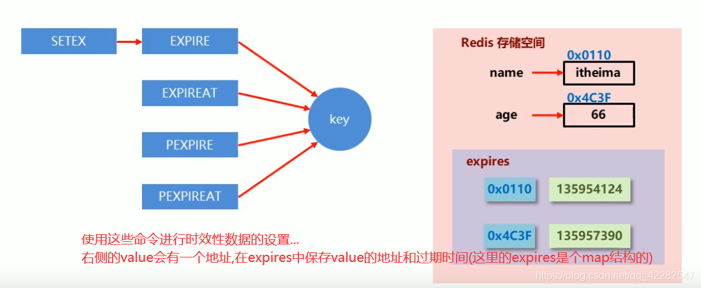

## 简介
Redis(Remote Dictionary Server即远程字典服务)是NoSQL类型的键值对存储数据库。
## 数据类型
String（整形、浮点型、字符串，统称为元素）<br/>
List（实现队列,元素不唯一，先入先出原则）<br/>
Hash（key唯一，可以看作Map<String,String>）<br/>
Set（各不相同的元素）<br/>
Sort set（有序集合）<br/>

## 安装

### Windows
1. [下载地址](https://github.com/tporadowski/redis/releases/download/v5.0.10/Redis-x64-5.0.10.zip)
2. 解压后安装，在安装目录运行CMD
3. `redis_dictionary>redis-server.exe redis.windows.conf`
4. 
   ```shell
	\\[10272] 15 Mar 08:48:38.095 # oO0OoO0OoO0Oo Redis is starting oO0OoO0OoO0Oo
	\\[10272] 15 Mar 08:48:38.097 # Redis version=5.0.10, bits=64, commit=1c047b68, modified=0, pid=10272,
	 just started
	\\[10272] 15 Mar 08:48:38.103 # Configuration loaded

                                                Redis 5.0.10 (1c047b68/0) 64 bit
                                    
                                                Running in standalone mode
                                                Port: 6379
                                                PID: 10272
                                    
                                                http://redis.io

	\\[10272] 15 Mar 08:48:38.152 # Server initialized
	\\[10272] 15 Mar 08:48:38.461 * DB loaded from append only file: 0.306 seconds
	\\[10272] 15 Mar 08:48:38.464 * Ready to accept connections
    ```
### Linux
>wget http://download.redis.io/releases/redis-5.0.7.tar.gz
> 
>tar -zvxf redis-5.0.7.tar.gz
> 
>mv redis-5.0.7 /usr/local/redis
> 
>cd /usr/local/redis/
> 
>make
>>Hint: It's a good idea to run 'make test' ;)
>>
>>make[1]: Leaving directory `/usr/local/redis/src'
>> 
>>[root@iz2ze9fctagto4qymjy32mz redis]#
> 
> make PREFIX=/usr/local/redis install
>>    INSTALL install
>>
>>    INSTALL install
>>
>>make[1]: Leaving directory `/usr/local/redis/src'
>>
>>[root@iz2ze9fctagto4qymjy32mz redis]#
> 
> ./bin/redis-server& ./redis.conf
>>30450:M 15 Mar 2021 09:16:14.642 * Ready to accept connections
>>
>>[root@iz2ze9fctagto4qymjy32mz redis]#

##与Spring整合
目前项目中已经使用JEDIS开发，因此以下使用对JedisAPI高度封装过的***SpringDataRedis-RedisTemplate***。
RedisTemplate相对于Jedis来说可以方便地更换Redis的Java客户端，比Jedis多了自动管理连接池的特性，方便与其他Spring框架进行搭配使用如：SpringCache等。
1. Pom.xml
```xml
    <dependencies>
        <!-- redis -->
        <dependency>
            <groupId>org.springframework.boot</groupId>
            <artifactId>spring-boot-starter-data-redis</artifactId>
        </dependency>

        <!-- conn pool -->
        <dependency>
            <groupId>org.apache.commons</groupId>
            <artifactId>commons-pool2</artifactId>
        </dependency>
    </dependencies>
```
2. application.yml
```yaml
    spring :
        cache:
        #cache-names: cache1,cache2,cache3
        redis :
          timeout: 0          
          cache-manager:      #配置了@EnableCaching注解就不用在这配置了
          database : 0
          host : 127.0.0.1
          port : 6379
          password :
          pool :
            max-active : 8    #连接数
            max-wait : -1     #连接等待
            max-idle : 8      #空闲
            min-idle : 0
```

3. 创建配置类Config.java继承CachingConfigurerSupport
    ```java
    /**
    * REDIS 配置
    */
    @Configuration
    @EnableCaching
    public class Config extends CachingConfigurerSupport  {
   
    }
    ```
   3.1 我们主要使用的对象为*org.springframework.data.redis.core*下面的*RedisTemplate*和*StringRedisTemplate*
所以创建配置类的目的也是为了或者这两个类的Bean,以及在使用之前的配置.
   ```
    @Bean
    public RedisTemplate<String, Object> redisTemplate(RedisConnectionFactory redisConnectionFactory, RedisSerializer jackson2JsonRedisSerializer) {
        RedisTemplate<String, Object> redisTemplate = new RedisTemplate<String, Object>();
        redisTemplate.setConnectionFactory(redisConnectionFactory);

        RedisSerializer stringSerializer = new StringRedisSerializer();

        redisTemplate.setKeySerializer(stringSerializer);//key序列化
        redisTemplate.setValueSerializer(jackson2JsonRedisSerializer);//value序列化
        redisTemplate.setHashKeySerializer(stringSerializer);//Hash key序列化
        redisTemplate.setHashValueSerializer(jackson2JsonRedisSerializer);//Hash value序列化
        redisTemplate.afterPropertiesSet();

        return redisTemplate;
    }
   
    @Bean
    public StringRedisTemplate stringRedisTemplate(RedisConnectionFactory redisConnectionFactory, RedisSerializer jackson2JsonRedisSerializer) {
        StringRedisTemplate stringRedisTemplate = new StringRedisTemplate(redisConnectionFactory);

        RedisSerializer stringSerializer = new StringRedisSerializer();

        stringRedisTemplate.setKeySerializer(stringSerializer);//key序列化
        stringRedisTemplate.setValueSerializer(jackson2JsonRedisSerializer);//value序列化
        stringRedisTemplate.setHashKeySerializer(stringSerializer);//Hash key序列化
        stringRedisTemplate.setHashValueSerializer(jackson2JsonRedisSerializer);//Hash value序列化
        stringRedisTemplate.afterPropertiesSet();

        return stringRedisTemplate;
    }
   ```
    

### RedisTemplate针对jedis主要封装了如下功能：

1. 连接池自动管理，提供了一个高度封装的“RedisTemplate”类
2. 针对jedis客户端中大量api进行了归类封装,将同一类型操作封装为operation接口
   ```
    ValueOperations：简单K-V操作
    SetOperations：set类型数据操作
    ZSetOperations：zset类型数据操作
    HashOperations：针对map类型的数据操作
    ListOperations：针对list类型的数据操作
    ```
3. 提供了对key的“bound”(绑定)便捷化操作API，可以通过bound封装指定的key，然后进行一系列的操作而无须“显式”的再次指定Key，即BoundKeyOperations：
    ```
    BoundValueOperations
    BoundSetOperations
    BoundListOperations
    BoundSetOperations
    BoundHashOperations
    ```
4. 将事务操作封装，有容器控制。
   ```
   multi  discard  exec  watch  unwatch
   ```
5. 针对数据的“序列化/反序列化”，提供了多种可选择策略(RedisSerializer)
    ```
    JdkSerializationRedisSerializer：
        POJO对象的存取场景，使用JDK本身序列化机制，将pojo类通过ObjectInputStream/ObjectOutputStream进行序列化操作，
        最终redis-server中将存储字节序列。是目前最常用的序列化策略。
    StringRedisSerializer：
        Key或者value为字符串的场景，根据指定的charset对数据的字节序列编码成string，
        是“new String(bytes, charset)”和“string.getBytes(charset)”的直接封装。是最轻量级和高效的策略。
    JacksonJsonRedisSerializer：
        jackson-json工具提供了javabean与json之间的转换能力，
        可以将pojo实例序列化成json格式存储在redis中，也可以将json格式的数据转换成pojo实例。
        因为jackson工具在序列化和反序列化时，需要明确指定Class类型，因此此策略封装起来稍微复杂。
        需要jackson-mapper-asl工具支持
    OxmSerializer：
        提供了将javabean与xml之间的转换能力，目前可用的三方支持包括jaxb，apache-xmlbeans；
        redis存储的数据将是xml工具。不过使用此策略，编程将会有些难度，而且效率最低；不建议使用。
        需要spring-oxm模块的支持
    ```

## 持久化
持久化分为快照方式(RDB)和日志方式(AOF)两种
### 快照
    RDB 是 Redis 默认的持久化方案。
    在指定的时间间隔内，执行指定次数的写操作，将内存中的数据写入到磁盘中。
    在指定目录下生成一个RedisDatabase File。
    Redis 重启会通过加载dump.rdb文件恢复数据
####使用方式
1. 配置文件redis.conf
```
    dbfilename dump.rdb
    
    #save <seconds> <keyChanges>
    save 900 1
    save 300 10
    save 60 10000
```
2. 直接使用***SAVE*** *立即执行,阻塞所有请求* 和***BGSAVE*** *BackgroundSAVE*命令
### 日志
    AOF是采用日志的形式来记录每个写操作，并追加到文件appendonly.aof中。
    Redis重启后根据日志文件的内容将写指令从前到后执行一次以完成数据的恢复工作。默认关闭。
    它的出现是为了弥补RDB的不足（数据的不一致性）
####使用方式
1. 配置文件redis.conf
```
    appendfilename "appendonly.aof"
    
    # no/yes
    appendonly no
    # fsync函数同步内存中所有已修改的文件数据到储存设备。
    # no/always/everysec
    appendfsync everysec
```

### RDB与AOF比较
|     | 优  | 劣    |
| ---------|:-----|:---------|
|RDB|单一文件,<br/>单独fork进程,无多余IO<br/>恢复大数据比AOF快|定时策略,可能丢失两次操作中间的数据      |
|AOF|频繁:每秒或者每次操作<br/>写入速度快<br/>可读|文件大,<br/>QPS(Query Per Second)低 |

## DB
Redis数据库是由一个整数标识，而不是由一个数据库名称。
默认一个客户端连接到数据库db0。
配置文件redis.conf中的databases参数来控制数据库总数，每库都有自己的命名空间，**重复key不会冲突**

    为了保持其独立性，同一个实例不适宜存储不同应用程序的数据。
    Redis非常轻量级，一个空Redis实例占用的内在只有1M左右，多个Redis实例不会额外占用很多内存。

    如可使用db0存储A应用生产环境中的数据，使用db1存储A应用测试环境中的数据，
    不宜使用db0存储A应用的数据而使用db1存储B应用的数据，不同的应用应该使用不同的Redis实例存储数据。

## 事务
执行exec时取消队列，已经执行的命令无法回滚。低可靠, 高性能
Redis的事务中，启用的是***乐观锁***，使用***watch***命令负责监控key有没有被改动过，
在事务中，如果任意一个监控的key有改变，则事务取消。
```java
    @Test
    public void test() {
        Jedis jedis = new Jedis("localhost");
        try {
            Transaction transaction = jedis.multi();
            transaction.lpush("key", "11");
            transaction.lpush("key", "22");
            int a = 6 / 0;
            transaction.lpush("key", "33");
            List<Object> list = transaction.exec();
        } catch (Exception e) {

        }
    }  
```

Redis与 mysql事务的对比：

|           |   Mysql           |   redis       |　
| ----------|:------------------|:--------------|
|开启事务	|start transaction  | multi         |
|执行语句	|SQL        	    | redis cmd     |
|失败	    |rollback   	    | discard       |
|成功	    |commit	            | exec          |

## 基本应用
    缓存：高频读、低频写。大数据量、低访问频率的业务不适
    计数器：如使用increment方法；限制单一IP频繁访问，每次访问后incr，到达限值后拒绝
    消息队列：Publish&Subscribe
    排行榜：ZSet进行rank排序，优于order by
    关系计算：set的集合命令union，diff
    Session共享：集群之间用户Session共享，省去重复出现登录操作

### 注解缓存
   `com.dev.redis.demo.cache.test.DictCacheTest.java`
   ```
   @Cacheable：缓存-DB-缓存
   @CachePut：将方法的返回值放到缓存中。
   @CacheEvict：删除缓存中的数据。
   ```

### 缓存预热
   `com.dev.redis.demo.cache.test.DictCacheTest.java`
   ```
   常用的通过代码写到项目里, 启动自动加载
   做一个页面, 启动之后手动刷新
   每次缓存访问做日志记录,count多的做缓存; 
   后台县城定时查询排名并作记录--存到list或sort set中选择排名高的 
   ```
### 缓存穿透、击穿、雪崩
      -查询一个一定不存在的缓存key    1.缓存数据库有数据的k->set 2.缓存空结果
      -并发查询一个刚刚失效的key      分布锁, 悲观锁(lua脚本或者setNX)-com.dev.redis.demo.lock.RedisLockTest
      -与上一条连锁                  ..
### 过期

    key在过期时会触发一个callback, 在java中可以监听到
   `com.dev.redis.demo.message.expired.KeyExpiredListener`
   #### 删除策略: 定时删除, 定期删除100ms-hz, 惰性删除
      
   ```
      127.0.0.1:6379> info server
      # Server
      redis_version:5.0.10
      redis_git_sha1:1c047b68
      redis_git_dirty:0
      redis_build_id:76de97c74f6945e9
      redis_mode:standalone
      os:Windows
      arch_bits:64
      multiplexing_api:WinSock_IOCP
      atomicvar_api:pthread-mutex
      process_id:10948
      run_id:ece51cfefd79305db8d44df7af722dc07344a5ec
      tcp_port:6379
      uptime_in_seconds:5141
      uptime_in_days:0
      hz:10
      configured_hz:10
      lru_clock:5183100
      executable:E:\program_flies\Redis\redis-server.exe
      config_file:E:\program_flies\Redis\redis.windows.conf
   ```

### 几点注意
1. 所有设置的缓存一定要有过期时间，否则会满
   - 淘汰策略, 
     - 从已设置过期时间的数据集（server.db[i].expires）中: 
        -  volatile-lru：最少使用
        -  volatile-ttl：将要过期
        -  volatile-random：随机选择
     - 从数据集（server.db[i].dict）中:
        -  allkeys-lru：最少使用
        -  allkeys-random：随机选择
     -  no-enviction（驱逐）：禁止，新写入操作会报错。
   - 默认` maxmemory-policy noeviction` 不会继续服务写请求 (DEL和GET可以继续进行)。
   
2. 一个key中最好不要存储过大量数据，比如超过了1G就应该考虑自己去做拆分存储
3. 命令复杂度的参考表 KEYS*

      String
      <table>
      <tbody>
      <tr>
      <td>命令</td>
      <td>时间复杂度</td>
      </tr>
      <tr>
      <td>set</td>
      <td>0(1)</td>
      </tr>
      <tr>
      <td>get</td>
      <td>0(1)</td>
      </tr>
      <tr>
      <td>del</td>
      <td>0(k)，k是键的个数</td>
      </tr>
      <tr>
      <td>mset</td>
      <td>0(k)，k是键的个数</td>
      </tr>
      <tr>
      <td>mget</td>
      <td>0(k)，k是键的个数</td>
      </tr>
      <tr>
      <td>incr</td>
      <td>0(1)</td>
      </tr>
      <tr>
      <td>decr</td>
      <td>0(1)</td>
      </tr>
      <tr>
      <td>incryby</td>
      <td>0(1)</td>
      </tr>
      <tr>
      <td>decryby</td>
      <td>0(1)</td>
      </tr>
      <tr>
      <td>incrybyfloat</td>
      <td>0(1)</td>
      </tr>
      <tr>
      <td>append</td>
      <td>0(1)</td>
      </tr>
      <tr>
      <td>strlen</td>
      <td>0(1)</td>
      </tr>
      <tr>
      <td>setrange</td>
      <td>0(n)，n为更改字符串长度</td>
      </tr>
      <tr>
      <td>getrange</td>
      <td>0(n)，n为获取字符串长度</td>
      </tr>
      </tbody>
      </table>
      
      Hash
      <table>
      <tbody>
      <tr>
      <td>命令</td>
      <td>时间复杂度</td>
      </tr>
      <tr>
      <td>hset</td>
      <td>0(1)</td>
      </tr>
      <tr>
      <td>hget</td>
      <td>0(1)</td>
      </tr>
      <tr>
      <td>hdel</td>
      <td>0(k)，k是键的个数</td>
      </tr>
      <tr>
      <td>hlen</td>
      <td>O(1)</td>
      </tr>
      <tr>
      <td>hgetall</td>
      <td>0(k)，k是field的个数</td>
      </tr>
      <tr>
      <td>hmget</td>
      <td>0(k)，k是field的个数</td>
      </tr>
      <tr>
      <td>hmset</td>
      <td>0(k)，k是field的个数</td>
      </tr>
      <tr>
      <td>hexists</td>
      <td>O(1)</td>
      </tr>
      <tr>
      <td>hkeys</td>
      <td>0(k)，k是field的个数</td>
      </tr>
      <tr>
      <td>hvals</td>
      <td>0(k)，k是field的个数</td>
      </tr>
      <tr>
      <td>hsetnx</td>
      <td>O(1)</td>
      </tr>
      <tr>
      <td>hincrby</td>
      <td>O(1)</td>
      </tr>
      <tr>
      <td>hincrbyfloat</td>
      <td>O(1)</td>
      </tr>
      <tr>
      <td>hstrlen</td>
      <td>O(1)</td>
      </tr>
      </tbody>
      </table>
      
      List
      <table>
      <tbody>
      <tr>
      <td>命令</td>
      <td>时间复杂度</td>
      </tr>
      <tr>
      <td>rpush</td>
      <td>0(k)，k是field的个数</td>
      </tr>
      <tr>
      <td>lpush</td>
      <td>0(k)，k是field的个数</td>
      </tr>
      <tr>
      <td>linsert</td>
      <td>0(n)，n是插入位置距离表头或表尾的距离</td>
      </tr>
      <tr>
      <td>lrange</td>
      <td>O(s+n)，s是start的偏移量，n是start到end的范围</td>
      </tr>
      <tr>
      <td>lindex</td>
      <td>O(n)，n是索引的偏移量</td>
      </tr>
      <tr>
      <td>llen</td>
      <td>O(1)</td>
      </tr>
      <tr>
      <td>lpop</td>
      <td>O(1)</td>
      </tr>
      <tr>
      <td>rpop</td>
      <td>O(1)</td>
      </tr>
      <tr>
      <td>lrem</td>
      <td>O(n)，n是列表的长度</td>
      </tr>
      <tr>
      <td>ltrim</td>
      <td>O(n)，n是要裁剪的元素总数</td>
      </tr>
      <tr>
      <td>lset</td>
      <td>O(n)，n是索引的偏移量</td>
      </tr>
      <tr>
      <td>blpop</td>
      <td>O(1)</td>
      </tr>
      </tbody>
      </table>
      
      Set
      <table>
      <tbody>
      <tr>
      <td>命令</td>
      <td>时间复杂度</td>
      </tr>
      <tr>
      <td>sadd</td>
      <td>O(k)，k为元素个数</td>
      </tr>
      <tr>
      <td>srem</td>
      <td>O(k)，k为元素个数</td>
      </tr>
      <tr>
      <td>scard</td>
      <td>O(1)</td>
      </tr>
      <tr>
      <td>sismember</td>
      <td>O(1)</td>
      </tr>
      <tr>
      <td>srandmember</td>
      <td>O(count)</td>
      </tr>
      <tr>
      <td>spop</td>
      <td>O(1)</td>
      </tr>
      <tr>
      <td>smembers</td>
      <td>O(n)，n为元素总数</td>
      </tr>
      <tr>
      <td>sinter</td>
      <td>O(m*k)，k为多个集合中元素较少的个数，m是键个数</td>
      </tr>
      <tr>
      <td>suinon</td>
      <td>O(k)，k为多个集合元素个数和</td>
      </tr>
      <tr>
      <td>sdiff</td>
      <td>O(k)，k为多个集合元素个数和</td>
      </tr>
      </tbody>
      </table>
      
      ZSet
      <table>
      <tbody>
      <tr>
      <td>命令</td>
      <td>时间复杂度</td>
      </tr>
      <tr>
      <td>zadd</td>
      <td>O(k*log(n))，k为添加 成员个数，n为当前成员个数</td>
      </tr>
      <tr>
      <td>zcard</td>
      <td>O(1)</td>
      </tr>
      <tr>
      <td>zscore</td>
      <td>O(1)</td>
      </tr>
      <tr>
      <td>
      <p>zrank</p>
      <p>zrevrank</p>
      </td>
      <td>O(log(n))，n为当前成员个数</td>
      </tr>
      <tr>
      <td>zrem</td>
      <td>O(k*log(n))，k为删除成员个数，n为当前成员个数</td>
      </tr>
      <tr>
      <td>zincrby</td>
      <td>O(log(n))，n为当前成员个数</td>
      </tr>
      <tr>
      <td>
      <p>zrange</p>
      <p>zrevrange</p>
      </td>
      <td>O(log(n)+k)，k为要获取成员个数，n为当前成员个数</td>
      </tr>
      <tr>
      <td>
      <p>zrangebyscore</p>
      <p>zrevrangebyscore</p>
      </td>
      <td>O(log(n)+k)，k为要获取成员个数，n为当前成员个数</td>
      </tr>
      <tr>
      <td>zcount</td>
      <td>O(log(n)+k)，k为要获取成员个数，n为当前成员个数</td>
      </tr>
      <tr>
      <td>zremrangebyrank</td>
      <td>O(log(n)+k)，k为要删除成员个数，n为当前成员个数</td>
      </tr>
      <tr>
      <td>zremrangebyscore</td>
      <td>O(log(n)+k)，k为要删除成员个数，n为当前成员个数</td>
      </tr>
      <tr>
      <td>zinterstore</td>
      <td>O(n*k) + O(m*log(m))，<br/>n是成员数最小的有序集合的成员个数，<br/>k是有序集合的个数，<br/>m是结果集中成员个数</td>
      </tr>
      <tr>
      <td>zunionstore</td>
      <td>O(n) + O(m*log(m))，<br/>n是所有有序集合成员个数和，<br/>m是结果集中成员个数</td>
      </tr>
      </tbody>
      </table>

### session
      .
### pub/sub
      .
### cluster
      .# jdev-redis
